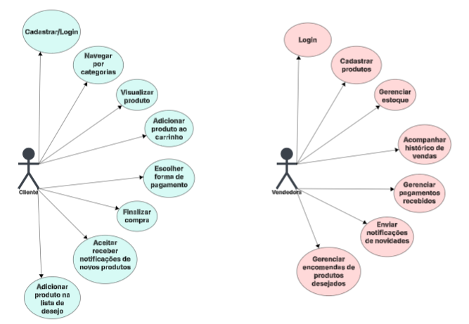
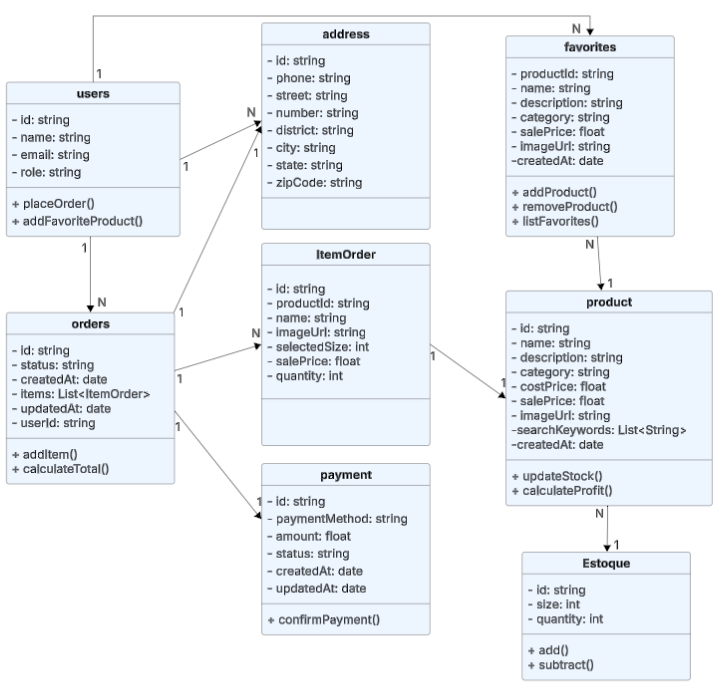
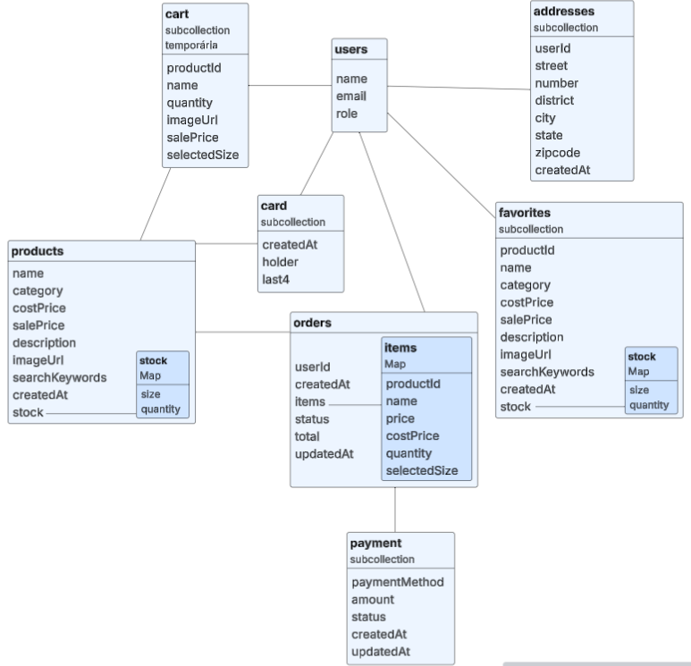

# 🛒 E-commerce White Label – LLKids

Este projeto implementa um sistema de **e-commerce white label**, permitindo que diferentes clientes utilizem a mesma plataforma personalizada com sua identidade visual.  
O sistema contempla desde o **cadastro de usuários** até a **gestão de produtos, pedidos e pagamentos**, tanto para usuários quanto para administradores.

---

## 📌 Funcionalidades

### 👤 Usuário (Cliente)
- Cadastro e login de usuários
- Visualização de produtos disponíveis
- Adição de produtos ao carrinho
- Finalização de pedidos
- Pagamento e confirmação

### 🛠️ Administrador
- Gestão de produtos (CRUD)
- Controle de estoque (tamanho, quantidade)
- Gestão de pedidos e atualização de status
- Gestão de pagamentos

---

## 🏗️ Arquitetura

O sistema segue uma arquitetura em **camadas**, separando responsabilidades entre **usuário, produto, estoque, pedido, item de pedido e pagamento**.

### Diagramas

📌 Diagrama de Caso de Uso 

📌 Diagrama de Classes  

📌 Diagrama de Coleções e Documentos  

---

## 💻 Tecnologias Utilizadas

- **Backend:** Firebase
- **Banco de Dados:** firestore/NoSql
- **Frontend:** Dart/Flutter
- **Controle de versão:** Git + GitHub
